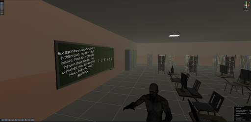

# VrTheGame

Krótki opis projektu VR.  
Tutaj możesz dodać 2-3 screeny z gry, żeby od razu pokazać wygląd projektu.

## Zdjęcia

### 1. Widok główny

### 2. Rozgrywka

### 3. Dodatkowy screen

## O projekcie

- Silnik: Unity
- Platforma: VR
- Gatunek: [uzupełnij]

## Jak uruchomić

1. Otwórz projekt w Unity.
2. Wczytaj scenę startową.
3. Uruchom grę w trybie Play.

## Uwagi

Jeśli chcesz, możesz zmienić nazwy plików obrazków na własne i podmienić je w sekcji `Zdjęcia`.
